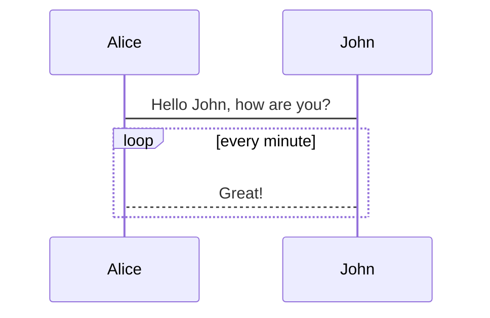

## Overview

Frontend development today involves a complex ecosystem. At Outsoar, we adhere to a set of best practices and guidelines for developing frontend applications. This guide aims to help you understand these best practices and guidelines.

## Pre-requisites

It is assumed that you have a basic understanding of HTML, CSS, and JavaScript. If not, we recommend learning these core technologies before proceeding with this guide.

- [HTML](https://www.w3schools.com/html/)
- [CSS](https://www.w3schools.com/css/)
- [JavaScript](https://www.w3schools.com/js/)
- [TypeScript](https://www.typescriptlang.org/) (optional)

:::tip
For a comprehensive learning path in frontend development, visit [roadmap.sh](https://roadmap.sh/frontend).
:::

## Our Frontend Manifesto

- **User-First Approach**: Our development process prioritizes the user, ensuring a seamless and engaging experience.
- **Performance Over Flourishes**: Performance takes precedence over aesthetic design. We strive for fast, responsive applications.
- **Accessibility**: Our applications are accessible to all, adhering to [WCAG](https://www.w3.org/WAI/standards-guidelines/wcag/) guidelines to ensure broad usability.
- **Security**: We commit to making our applications secure by following industry-leading security practices.
- **Developer Experience**: We ensure a positive developer experience, regardless of the framework or library. We believe that a productive developer leads to better applications and lower costs.
- **No Bias**: We are framework-agnostic. We choose the right tool for the job, not the most popular one.

