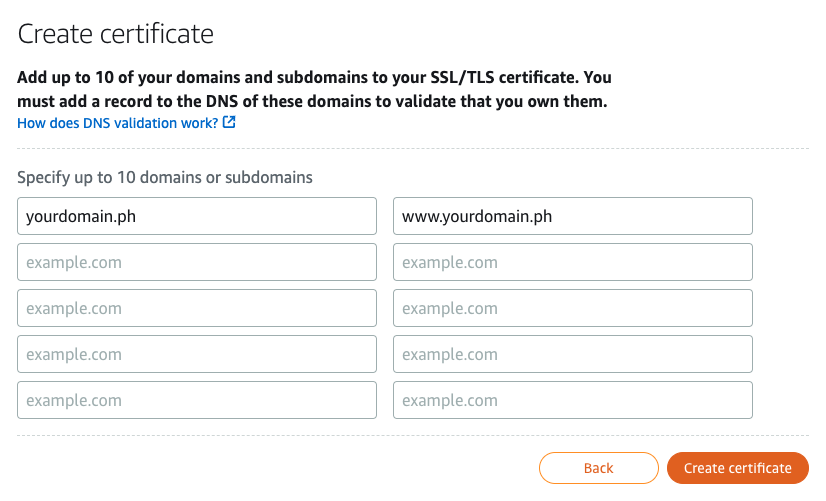
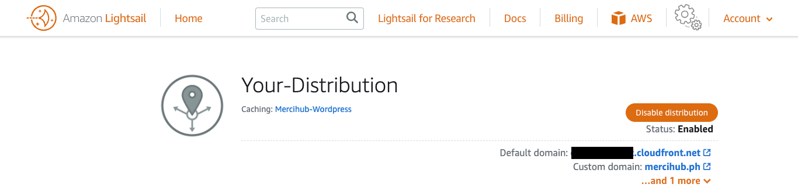

# Tutorial: Adding a CDN to Your Lightsail Instance

## Prerequisites

Before getting started, make sure you have the following:

- An active Amazon Lightsail account
- A Lightsail instance running your website or application
- Basic knowledge of managing Lightsail instances
- Familiarity with DNS configuration (optional but recommended)

## Steps

### 1. Log in to the Amazon Lightsail Console

Go to the [Amazon Lightsail Console](https://lightsail.aws.amazon.com/ls/webapp/home/instances) and log in using your credentials.

### 2. Select Your Lightsail Instance

From the dashboard, locate the Lightsail instance you want to add a CDN to and click on it to open its management page.

### 3. Access Networking Tab

Navigate to the "Networking" tab within the Lightsail instance management page.

### 4. Create Static IP (If Needed)

If your Lightsail instance doesn't already have a static IP assigned, you may want to create one. This is not mandatory for setting up a CDN but can be helpful for DNS configuration.

### 5. Click on "Create Distribution" (CDN)

Under the "Networking" tab, find the section for "Create distribution" and click on it.

### 6. Configure CDN Settings

- **Select Your Origin:** Now select your origin, in our case the instance is located in Singapore (ap-southeast-1) Region, simply select it.
- An origin is the authoritative source of material for your distribution. When you build a distribution, you select the Lightsail instance, container service, bucket, or load balancer (with one or more instances connected) that will host the content of your website or web application.

- **Choose Distribution Type:** Select the type of distribution you want. For most web applications, "Web" distribution is suitable. But in our case, we will `select 
Wordpress` because it has the settings we need for our Wordpress site
    - a prompt will popup, simply select Yes, apply.

- **Distribution Protocol Policy:** Choose whether to allow both HTTP and HTTPS traffic or HTTPS only.

- **Default Cache Behavior Settings:** Configure caching settings based on your application's requirements. In our case, Lightsail already selected the best for our needs.

- **Choose Your Distribution Plan and Naming Your Distribution:** 
    - Choose what's best suitable for your distribution and budget plan. 
    - Choose a unique name for your distribution.

### 7. Create CDN Distribution

After configuring the settings, click on the "Create Distribution" button to create your CDN distribution. It may take a few moments for the distribution to be provisioned.

### 8. Update DNS Records
If you're using a custom domain, you'll need to update your DNS records to point to the CDN. Create a CNAME record pointing to the CDN distribution domain name provided by Lightsail.
- *follow these steps:*
    1. **Navigate to the "Domains & DNS" Tab in Amazon Lightsail:** Access your Lightsail console and locate the "Domains & DNS" section.
    2. **Find the Name Servers provided by Lightsail:** Within the "Domains & DNS" tab, you'll find the name servers provided by Lightsail. These are crucial for managing DNS settings for your custom domain.
    3. **Update the DNS Records:** Depending on your DNS provider, locate the option to manage DNS records. Create a new CNAME record and point it to the CDN distribution domain name provided by Lightsail. This typically involves entering the subdomain (e.g., `cdn.yourdomain.com`) and the corresponding CDN distribution domain name.

### 9. Custom Domain
If you want a custom domain for your distribution, you can add it to your distribution. 
- *follow these steps:*
    1. Navigate to `Networking` tab in Amazon Lightsail and select Customs Domains
    
    2. Select the `Create Certificate`, a popup will appear, proceed adding a name and select `Continue`.
    
    
    3. Now add your origin domain, and www then click `Create Certificate`. *example*:
        - it will take some time to create the certificate. 
    
    4. Attach your verified certificate
        - In the Certificates section, choose Attach certificate.
        - Select a certificate from the dropdown list.
        - Choose Attach to attach the certificate.
    

### 10. Route Traffic to Your Distribution
Once the CDN distribution is created and DNS records are updated or has verified its certificate(if applicable), test your website or application to ensure it's being served through the CDN.

    1. Navigate to `Domains & DNS` tab and select your deployed domain.
    2. Select the `DNS records tab` and select `Add record`
    3. The value should be `@`, select `A record` for record type. Copy your deployed distribution link from earlier and paste it to the `Resolves to` input field. Click Save.

    4. Add a record again but this time Select `CName record` for record type and `www` for value. Copy your deployed distribution link from earlier and paste it to the `Route traffic to` input field. Click Save.

    5. Test your website, to see if AWS Cloudfront (CDN) is being used, simply look for an x-cache response header. It will mention Cloudfront (e.g., Hit from Cloudfront or Miss from Cloudfront). 
        1. To view this, go to the web-page and right click -> Inspect (or hit f12)
        2. Select the Network tab and reload the page. 
        3. Select a file look for the response header `x-cache` to see if Cloudfront is being used. If it is, the value will be `Hit from Cloudfront`.
        - 

## Congrats
You have successfully added a CDN to your Lightsail instance. Your website or application should now be served through the CDN, providing improved performance and scalability.
*see the image below for a visual representation of the flow.*

